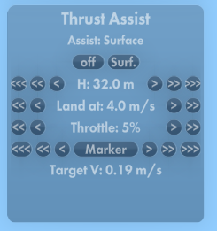
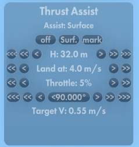
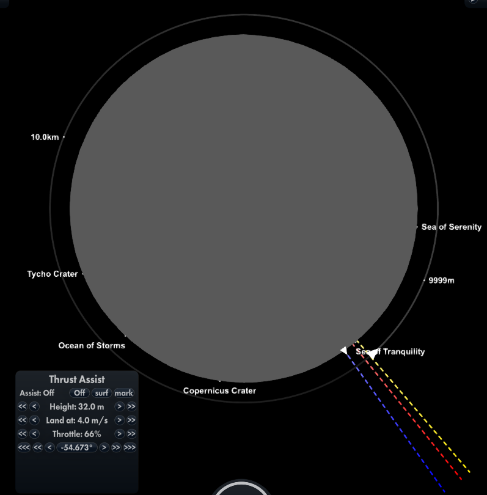

# Thrust-Assist-SFS1

Thrust assistance mod for Spaceflight Simulator 1

**Marker off**

**Marker on**

**Assist** Selects the type of assistance
* 'Off' Switch assistance off (manual control)
* 'Surf' Assist with landing on the surface (i.e vertical velocity with respect to the planet)
* 'Mark' Assist with de-orbiting to land at the selected marker (i.e horizontal velocity with respect to the planet). Visible when the marker is enabled.

If _surface_ assistance is selected, taking the orientation of the rocket into account, this mod will set the thrust to attempt to reach 0 m/s vertical velocity at the specified altitude. If the altitude is set to _surface_ (the minimum altitude) it will attempt to land at the specified velocity.

If _marker_ assistance is selected, taking the orientation of the rocket into account, this mod will set the thrust to attempt to reach 0 m/s horizontal velocity at the specified mark.

**Height** The target altitude, only used for _surface_ assistance. N.B. this is from approximately the bottom of the rocket (CoM-'radius'), not the CoM.
* <<< _set minimum value_ i.e. attempt to land
* << _reduce value_
* < _reduce value by 0.5m_
* \> _increase value by 0.5m_
* \>\> _increase value_
* \>\>\> _set maximum value_

**Land at** The target landing speed, only used for _surface_ assistance. Is ignored unless the height is set to the minimum value.
* << _set minimum value_
* < _reduce value_
* \> _increase value_
* \>\> _set maximum value_

**Throttle** The target throttle to be used. This is used to estimate the velocity needed.
(controls as land at)

**Marker** Enable the landing marker. When enabled will show the position of the current marker.
* <<< _move marker anti-clockwise to the next landmark or landed rocket_
* << _move marker anti-clockwise 1km_
* < _move marker anti-clockwise 30m_
* \>  _move marker clockwise 30m_
* \>\> _move marker clockwise 1km_
* \>\>\> _move marker clockwise to the next landmark or landed rocket_

The blue line is the marker position. The yellow line is the position where de-orbiting is to start assuming the correct orientation (usually retrograde) and the selected throttle with the current rocket mass and switched on engines. The red line is the position where deorbiting must start assuming 100% throttle i.e the last position that you can de-orbit at to reach the target.

---

Currently I use it to land more efficiently. It will set the throttle to reduce the vertical velocity so the spacecraft comes to a stop at the specified altitude. This allows me to land faster and so spend less fuel.

If _surface_ assistance is selected and the target altutude is set to the minimum value it will aim to reach the target altitude at the specified vertical velocity i.e land at that velocity. It does not control direction so the spacecraft needs to be pointed up to land. If, when hovering at a specified altitude, you rotate the spacecraft (do not point if down!) it will increase the throttle to maintain altitude as you start to move sideways. While moving sideways it will try to maintain the same altitude above the terrain - following the contours. This is to allow you to pick a landing site. It works best when used with SAS to maintain the desired direction.

The following example is for a Lunar landing in Normal starting from a 10km orbit with plenty of thrust (earth TWR around 1 - local TWR nearly 6) the details will vary in other situations. To land with it from orbit.
1. First enable the marker and select the position you want the land at. 
2. Next, timewarp to a little short of the yellow dotted line on the map, point retrograde and select _marker_ and (optionally _surface_) assistance. When the yellow dotted line is reached the engines will start.
3. Once you are close, select _surface_ assistance (if not alorady on) also ('Both' will be displayed) aiming for the default target altitude of 32m.
4. When the marker is reached switch off _marker_ assistance.
5. Once at the target altitude, switch 'prograde' off in SAS and manually set the direction to reduce the remaining sideways velocity to zero. Alternately, to move sidewise, tilt a little in the direction to start moving in and tilt back once the desired position is reached. **Important** Ensure _marker_ assist is off (and _surface_ on) when hovering. If _marker_ assist is left on thrust may increase above the amount needed for hover in order to attempt to reach the target.  By design, the engines will cut off if _surface_ assist is switched off while hovering.
6. Finally set SAS to Surface 0 degrees and change the target altitude to the minimum. The spacecraft will land at the specified velocity.

For more efficient landing or with lower thrust you might want to angle a bit up from prograde once descending and maybe adjust the marker position. It will require a little practice to get this right.

Future plans include providing thrust assistance when approaching a target.
